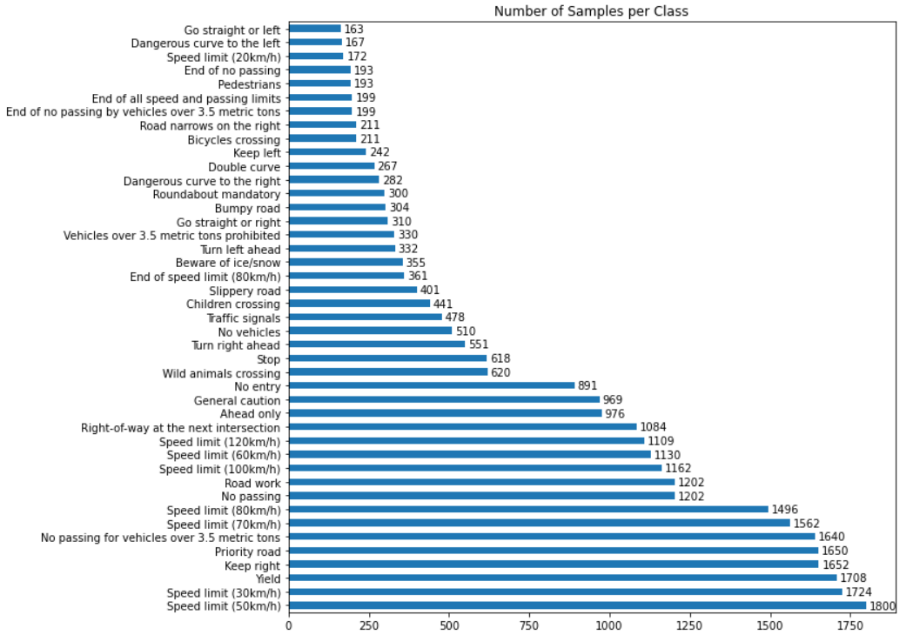
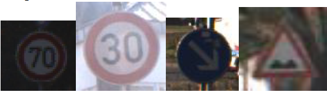
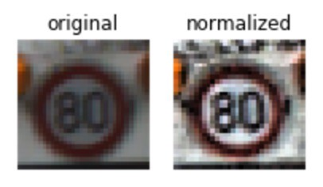
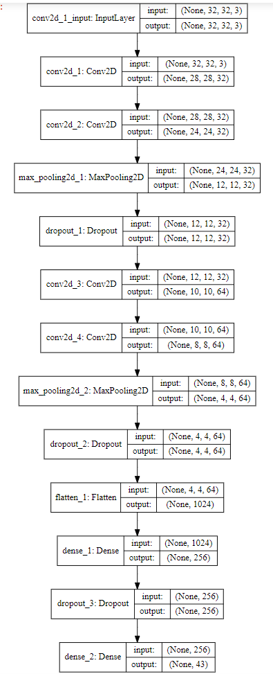
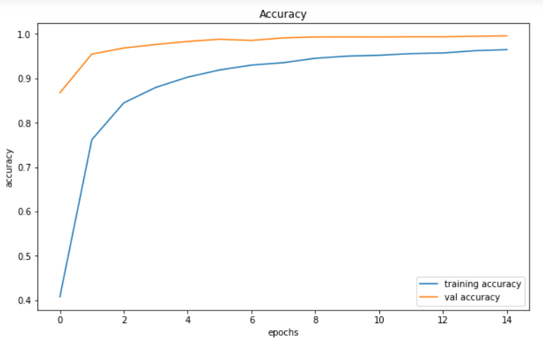
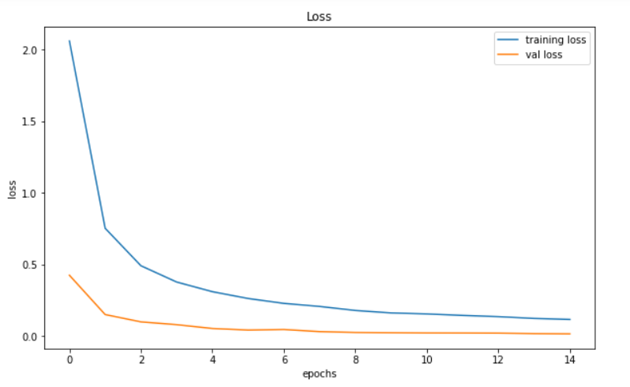
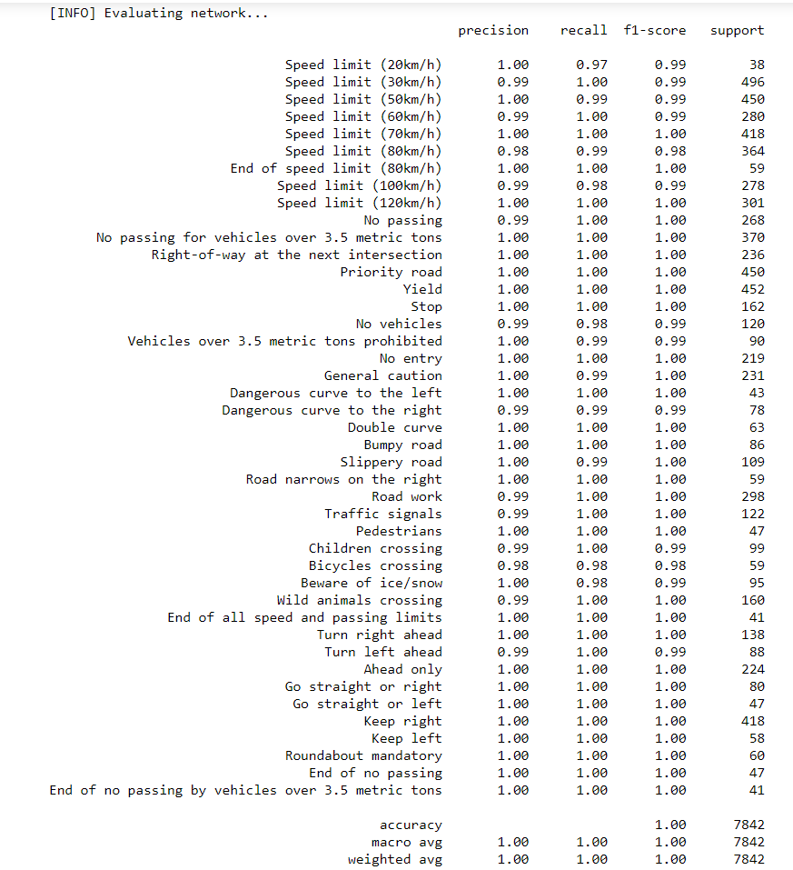
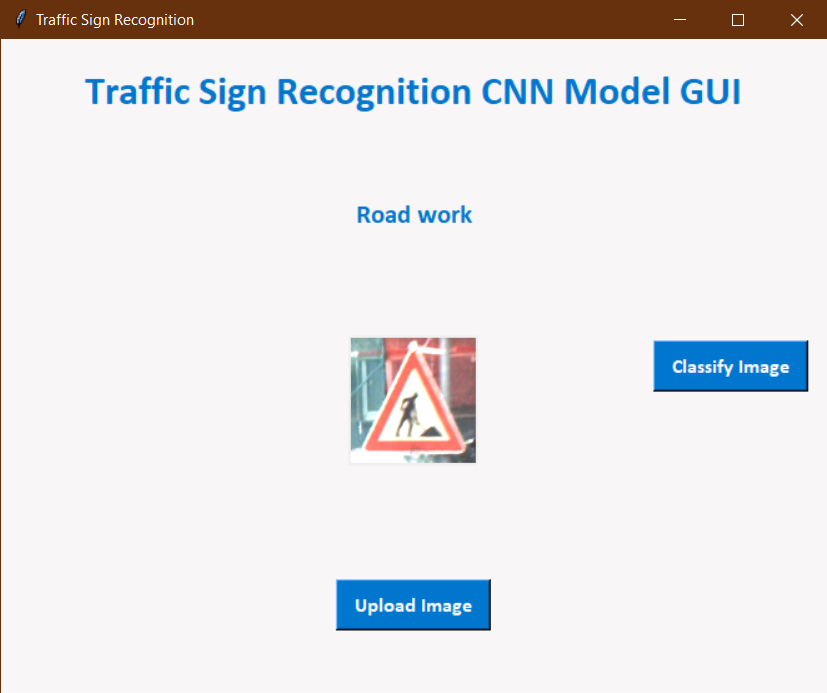

# **Traffic Sign Recognition for Autonomous Vehicles using Deep Learning**

## Tech Stack

1. Anaconda Environment with Python 3.7.7 64-bit
2. Jupyter Notebook
3. Libraries -  Keras, TensorFlow, Scikit-Learn, Scikit-Image, OpenCV, Pandas, Numpy, Matplotlib, TKinter, PIL

## Introduction

**Traffic Sign Recognition (TSR)** is a fundamental part of any autonomous driving system. Mobility of the near future relies on such a system for safe navigation amongst traffic comprising of humans and other autonomous vehicles.

The primary objective of this project is to design and develop a robust and computationally lightweight model, to accurately classify traffic signs on the road. A sizeable portion of the prior works on this field have used conventional methods of computer vision and classification. This project, on the other hand, utilizes a **deep convolutional neural network (CNN)** to achieve high classification accuracy while being easy to deploy on automotive hardware. **TensorFlow and Keras** will form the underlying architecture of the classification model.

The dataset used for this project is the **[German Traffic Sign Recognition Benchmark (GTSRB)](https://www.kaggle.com/meowmeowmeowmeowmeow/gtsrb-german-traffic-sign)** available publicly on Kaggle. **This dataset contains over 50,000 images and 43 classes.** A further objective of this project is to demonstrate the use of enhanced image preprocessing and augmentation techniques to improve the classification accuracy of deep convolutional network model that is fit to be deployed in real-world scenarios.

A simple **Graphical User Interface (GUI)** has also been developed to demonstrate its performance. The model can correctly classify traffic sign images of varying quality in terms of resolution, lighting, and orientation. The final CNN model designed for this project can achieve **near-instantaneous results with 98% accuracy** on the test set.

## Data Extraction

The **[GTSRB](https://www.kaggle.com/meowmeowmeowmeowmeow/gtsrb-german-traffic-sign)** dataset has over 50,000 images. The complete source code for this approach has been written in Python (3.8.2 64bit) in a Jupyter Notebook environment. I have used the NumPy and Pandas libraries for data extraction and manipulation.

The dataset file structure consists of Train and Test folders containing the images for training and testing, respectively. The train folder has 43 subfolders containing images belonging to a particular class (Eg. All stop signs are in one folder, similarly all yield are in another folder).

Moreover, there are two csv files - train.csv and test.csv that contain the dimensions, path of each image in their respective folders and ClassIDs that denote their true class. The signnames.csv file contains the mapping from ClassID to its corresponding traffic sign name or label.

## Data Summary and Visualization

I have used all the images in the Train folder in an 80-20 training testing split for the model.
Number of training samples = 31367
Number of testing samples = 7842
Number of labels/classes = 43

This graph created using Matplotlib plots the number of images in each class showing how the images are distributed within the dataset.



We note from the visualization that the distribution is skewed towards some classes as they have about 10x more samples than some other classes. We shall account for this before we begin training the model.

## Image Preprocessing

To figure out what kind of image preprocessing or enhancement techniques should be applied, let us look at some samples from the dataset.



Almost all images are of different sizes, so before I applied any image processing, I resized them to 32x32 pixels. Next, I noticed how poor the lighting/contrast/brightness was on the images. This remains a theme throughout most of the dataset. To address this issue, I applied the Contrast Limited Adaptive Histogram Equalization (CLAHE) transformation implemented in the Scikit-Image library. CLAHE not only improves contrast and brightness, but it also normalizes the images. The figure below shows how the technique is great for enhancing a dark image.



## Image Augmentation

Another thing to note is that most of the images have a good viewing angle, most of them have a head-on view of the sign, which is good for training but might not represent true real-life situations. Hence a little augmentation applied to the images might make the model more robust as the augmentations will help mimic real-life scenarios. I used the ImageDataGenerator module from TensorFlow library to define the augmentation.

1) **ZCA Whitening** – This helps to highlight the edges of a traffic sign image and improve sharpness especially for those images with dark backgrounds.
2) **Physical Transformations on rotation, zoom, shearing, and dimension** – Changing these attributes helped to represent real-world scenarios where a sign might be damaged or rotated, or the image captured from a camera might not have a good viewing angle. No horizontal or vertical flips are needed because in real-life signs are not going to be flipped.
3) **Color Shifts** – I initially applied grayscaling as a preprocessing to the images but it made the issue of low contrast/brightness even worse and so instead went for a slight color shift so that the model is not overfitted to one particular color or shade.

## Model Architecture

The follwing figure shows the architecture of the best performing model.



## Training and Testing

I set the number of epochs as 15 and batch size as 64. To account for class skew in the dataset, I assigned a class weight which helps the model to handle image samples from under-represented classes better.

Finally, I used the ```model.fit()``` method with the augmentation defined in section B and all the necessary parameters such as batch size, epochs, the validation data (20% of the training set), and the class weight. On the completion of this training phase, I observed an excellent accuracy of 99% on the validation data.

I plotted graphs of accuracy vs epoch and loss vs epoch for the trained model which showed a clear trend of convergence with an increase in epochs.





## Results and Evaluation

The model described in the above section has been the result of multiple iterations on an initial basic model with little image preprocessing and no overfit mitigation strategies in place. In this section, we evaluate three models – **Model A with no dropout layers, Model B with one dropout layer, and Model C with enhanced image preprocessing and augmentation as well as dropout layers.** This is the model that has been described in detail in the previous section.

Model A is a basic model with 7 layers and no dropout layers. It showed good accuracy of around 96% while training, but its testing accuracy was just 90% on the test set meaning it was suffering from overfitting.

For Model B, I added two more Conv2D layers as well as a dropout layer and trained and tested it again. There was a noticeable increase in the accuracy, which was now about 94% on the test set.

Finally, for Model C, I applied the image pre-processing techniques such as CLAHE transformation to improve contrast and brightness as well the image data augmentation mentioned in section II. I also added 2 more dropout layers to the model.
**This model achieved the highest accuracy of 98% on the test set.**

These results were very encouraging as they confirmed that good image preprocessing techniques can improve a model’s accuracy and make better predictions on images that were previously misclassified. Adding the dropout layers had also helped to prevent overfitting that was present in Model A and B.

I used Scikit-Learn to generate the accuracy score on the test dataset and generate a classification report for Model C.



## Building a Graphical User Interface (GUI)

To test and interpret the results of an image classifier such as this, it is always helpful to have a way to see the results for yourself. I initially created a function in the Jupyter Notebook which would fetch 25 images at random from the Test set of the GTSRB dataset and predict the traffic sign class it belonged to. I used OpenCV to put the predicted class/label on the image itself and save it to the disk. This was a quick and easy way to check and confirm results after each run of the model.

While the above method was good for trial and testing, a proper Graphical User Interface (GUI) is much better for demonstrating and presenting the capabilities of a model.
I used the Tkinter python library to create a simple GUI for testing the model. The GUI enables a user to upload an image and then hit the classify button to use the pre-trained model to make a prediction. The predicted class/label is then displayed on the GUI. The GUI also measures the processing time of the classification process.



## Summary and Conclusion

The model achieves 99% accuracy on the validation set and 98% on the testing set. Also, the model has a processing time of about 0.1s on 4-core CPU with no GPU acceleration.

This project demonstrates that deep learning as an approach to solving image classification is an iterative process and it is important to establish a good baseline and then work towards improving the model gradually.

The image preprocessing techniques such as CLAHE to improve contrast/brightness and augmenting the image data to mimic real-life scenarios helped the model to be more generalized. Regularization techniques such as adding Dropout layers were great for preventing overfitting.

## Future Scope

This project can be further extended to incorporate an object detection system as well. A system that can capture images in from a camera, detect and recognize traffic signs in real-time would make it a full-fledged standalone system. Further, model architecture can still be tweaked to improve performance and there is scope for latest architectures such as ResNet and GoogLeNet to be incorporated.
